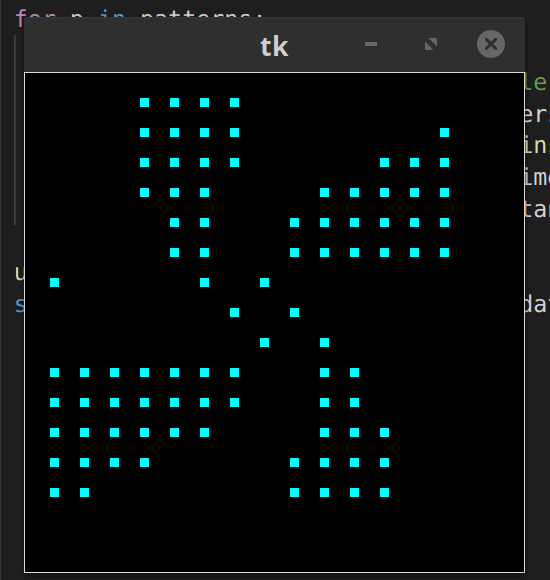
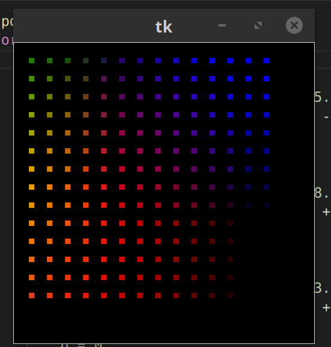

# ledcap

An animated RGB LED graduation cap, running on a Raspberry Pi.

## Images

The assembled graduation cap is a 14x14 LED matrix
of WS2812B NeoPixels driven by a Raspberry Pi.
Patterns are selected using a prototyping board
with several buttons connected to the Pi's GPIO.
A breakaway connector is used to connect the two,
improving portability.

Other projects like this exist with different
materials. I chose NeoPixels
since they are cheap and relatively easy to drive
(in comparison to video walls). A Raspberry Pi was used
since it's easy enough to work with, and if I had the
time I could do fancy stuff like run a webserver.

Underneath the covers of the cap, the center
is actually just cardboard. The LED strips
that I used had an adhesive backing. I bought
several meters of these strips, cut them into strips
of 14, and stuck them onto the cardboard center.
Because the signal of the NeoPixels are chained
together, the strips are oriented in a zig-zag
pattern. Soldering these strips together took some time,
as the pads are somewhat fragile.

## Simulator

I've done a few projects with these LED strips before,
like [Internet-Xmas-Tree] and [PatioLightsHost].
When developing these projects its always been difficult
to quickly test that things are working on the actual
hardware.

I built a simulator application using Tkinter to
mimic the look of the hardware. This also encouraged
a more modular design. It made the initial development
a lot faster.

[Internet-Xmas-Tree]: https://github.com/Chris-Johnston/Internet-Xmas-Tree
[PatioLightsHost]: https://github.com/Chris-Johnston/PatioLightsHost
